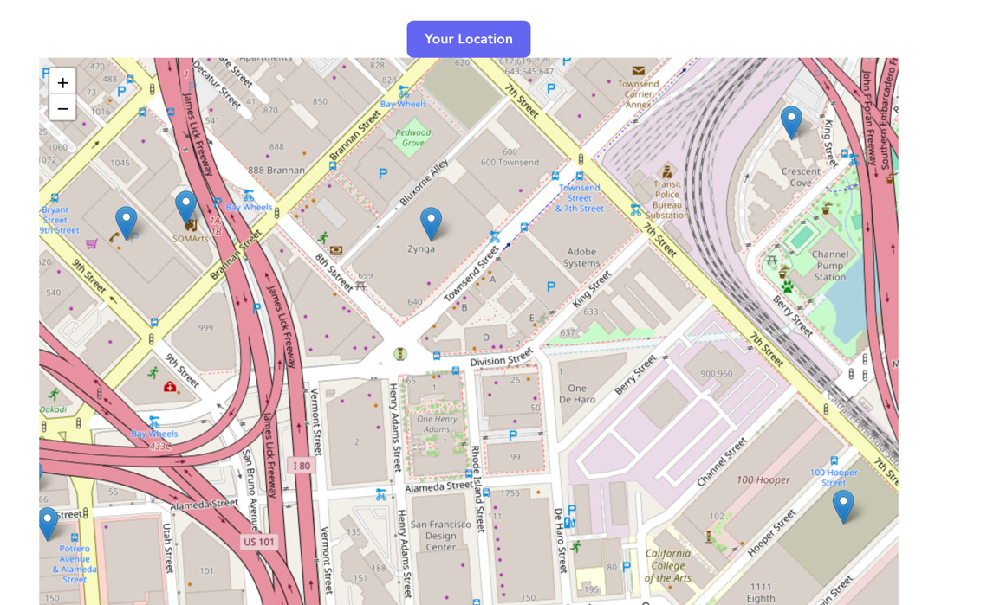
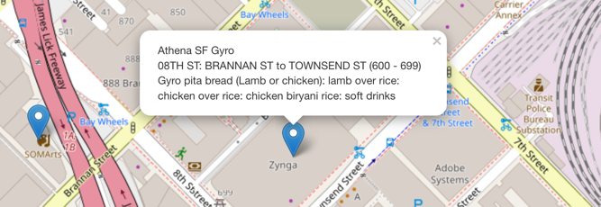
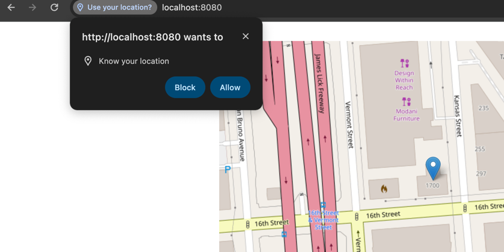
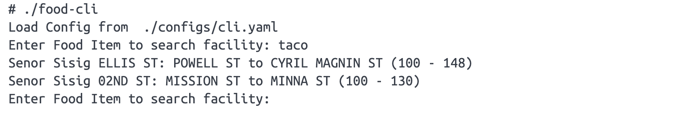

# Food trucks 
This is a demo project showcase usage of Go, React, Redis, Docker.
Data is from San Francisco's food truck open dataset.

## Features
As a user, when you go to the websites' home page, you can see a list of marker, 
each marker represents a food truck.



When you click a marker, you can see the food truck's applicant, location, and food items.



If you live in San Francisco, you want see the trucks near your location, 
you can click 'Your Location' button, the map will be switched to your location



As a admin, you can search all trucks who are serving a type of food, e.g. taco



## Tech Stacks
### Backend
- Redis as in memory database
  - redis str, get truck(marshalled as json) by ID
  - redis geo, to search nearby trucks by latitude, longitude, and radius.
  - redis zset, to search a list of trucks by food items it served.
- Go  
- Iris Web Framework

### Frontend
- React
- react-leaflet for map related feature
- swr for state management

## Design pattern and best practice
- *hexagonal architecture*


The core of backend is /backend/packages/services/facilitySvc.go, service layer doesn't depend on
storage layer, and doesn't depend on UI layer.   
Both Cli and Web can use facility service.

- *Dependency Injection*

facilitySvc is not hardcoded depending on rdb package(my own Redis lib), so if I want
change storage to mysql or mongodb later, I can implement the interface
and inject the implementation to service.

This also conform to Open/Close principle, the facilitySvc is open to extend functionality, 
but close to code change

- *Template pattern*

There are a lot of boilerplate to start a web application, 
I put these code to /backend/packages/util/irisbase applying Template Pattern,
so the main file(/backend/cmds/web/main) looks clean and straightforward.

- *Error handling*  

Each function annotate error detail (e.g. which line throws the error, the cause of the error).
In develop mode, the API returns error detail to help frontend user to locate the issue.
In production mode, the API just return an 500 error to hide technical detail

- *Generic Programming to improve ability to reuse code*

A function gets a key from Redis, then use json.unmarshal 
to convert it to an object, A straightforward implementation is:
```
str := redis.Get(myKey)
var object MyObject
if err := json.Unmarshal([]byte(str), &object); err != nil{
  return error
}
```
by using generic
```
var myObjectStore := rdb.NewEntityStore[string, MyObject]()

object,err := myObjectStore.Get(myKey)
```
the benefit of wrap redis str as EntityStore is : 1) save the trouble of write boilerplate 
code. 2) it ensures type safe, if I try to get MySecondObject from myObjectStore, I will get
a compile time error.

- *Separation of Concern*

When do frontend coding, I also tried to apply this principle, for the truck map frontend.
I use 3 components to render map, each component care about it's own job, improved readability.
  * /frontend/src/map/Map.tsx
  * /frontend/src/map/FacilityMarker.tsx
  * /frontend/src/map/SwitchLocation.tsx

- *Modular and DRY - Don't repeat your self*

I tired to separate business logic and infrastructure code. Take facilitySvc as example
each facility has multiple food items, each food item can match multiple facility, this relationships 
is business related, but connect to redis, marshal object to json string, are common infrastructure code. 
By warping redis operation as a standalone package instead of put code to facility service. 
I make the code more modular and easy to re-use.

## Implementations
### Frontend
#### Code Structure
```
--frontend/
----src/
------map/
--------FacilityMarkers.tsx   # add markers to map
--------Map.tsx               # map container
--------SwitchLoaction.tsx    # switch to your location
------models/
------utils/
------config.ts               # global configs
----.env.development          # development enviroment virables
```
#### Api call and state management
All meaningful code resides in /frontend/src/map, code in models and utils is very simple. 
the useSWR hook combine api call and state management, one single line of code save the trouble of useEffect hook. 
```
    const {data: center} = useSWR(Config.APIHost + '/api/facilities/center', fetcher)
```
#### Environment variables
In development mode (pnpm dev), I start two web server, 
* http://localhost:8080 as backend   
* http://localhost:5173 as frontend
 
In production mode frontend and backend are served as single app, so I can 
use relative path to call backend api /api/facilities. In development, I have to add
a prefix http://localhost:8080 in front of endpoint. I put this settings to .env.development
```
VITE_REACT_APP_API_HOST='http://localhost:8080'
```
In production there won't be .env file, so the api host default to '', this code is put to config.ts 
```
export const Config = {
    APIHost : import.meta.env.VITE_REACT_APP_API_HOST || '',
}
```
#### Map Related Features
I tried google map API first, but it's not totally free, I don't want checkin API Key to repo. And I want 
people can easily play with this app, so I followed this link https://medium.com/@ujjwaltiwari2/a-guide-to-using-openstreetmap-with-react-70932389b8b1 
to use react-leaflet
### Backend
#### Code structure
```
--cmds
----cli/          # entrance of cli
----web/          # entrance of web
--packages
----controllers/  # endpoint of APIs
----models/      
----services/     # implement business logic of food trucks
----utils/        # infrastrcutres
--web/            # put frontend distribution hear
```
#### Seed Data
In packages/services/facilitySvc Seed() function, it read configs/data.csv, and parse it as Facility array,
then populate the data to redis.

### Endpoints
- */api/facilities/center*  Get the center of all trucks
- */api/facilities?lat=&lon=&radius=* Get the facilities near the center with in the radius 
### Cli 
- share Facility Service with web, provides function of search facility by food items

## Installation
If you don't have go, node, pnpm installed on you local machine, you can simply use docker compose to start the app.
in the root directory of the project, run
```shell
docker-compose up
```

## Development
### Spin up a redis server
```shell
docker run --name food-redis -d -p 6379:6379 redis
```
### Start backend
go to /backend, 
```shell
go run backend/cmds/web/main.go
```
if you got the following error 
```
panic: facilitySvc.go:58 failed to cache facilities, dial tcp: lookup redis: no such host
```
you can add redis to you development machine's /etc/hosts file
```
127.0.0.1       localhost redis
```
or you can modify /backend/configs/web.yaml file, change the following line
```
  addr: redis:6379
```
to 
```
  addr: localhost:6379
```
### Start CLI
```
go run backend/cmds/cli/main.go
```
it's config file is at /backend/configs/cli.yaml

### Start Frontend
you need to install node, pnpm, then go to frontend/, run
```
pnpm install
pnpm dev
```
